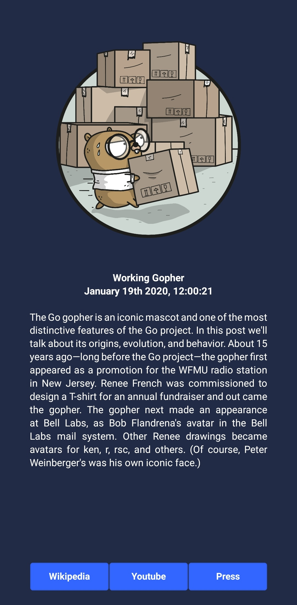

# Workshop 1 React Native

Dans ce premier workshop nous allons apprendre à utiliser React Native en réalisant une application basique utilisant l'api de SpaceX.

- [Workshop 1 React Native](#workshop-1-react-native)
  - [Mise en place](#mise-en-place)
      - [Installer NodeJS et npm](#installer-nodejs-et-npm)
      - [Installer expo](#installer-expo)
      - [Création du projet](#cr%c3%a9ation-du-projet)
  - [Fondamentaux de React Native](#fondamentaux-de-react-native)
      - [JSX](#jsx)
      - [Components](#components)
      - [Props](#props)
      - [Style](#style)
  - [Exercice 1](#exercice-1)
  - [Librairie UI Kitten](#librairie-ui-kitten)
  - [Exercice 2:](#exercice-2)
  - [Utiliser l'API de SpaceX](#utiliser-lapi-de-spacex)
      - [Les states](#les-states)
      - [Axios](#axios)
  - [Exercice 3](#exercice-3)


---
## Mise en place

#### Installer NodeJS et npm
Pour vérifier si vous avez déjà nodejs et npm sur votre ordinateur, tapez les commandes suivantes dans votre terminal.
```shell
node -v
npm -v
```
Si l'une des deux commandes ne fonctionne pas, [suivez ces instructions](https://nodejs.org/en/download/package-manager/).

#### Installer expo
Expo est un outil construit autour de React Native et des plateformes natives qui aide au développement, build et déploiement des applications.  
Expo a donc une interface CLI et une interface mobile permettant un rendu de l'application en temps réel avec un hot reload.

Tapez cette commande dans votre terminal pour installer expo-cli
```bash
npm install -g expo-cli
```

Installez l'application Expo sur votre smartphone [Android](https://play.google.com/store/apps/details?id=host.exp.exponent) ou [iOS](https://itunes.com/apps/exponent)

#### Création du projet
Pour créer le projet, tapez cette commande dans votre terminal dans le dossier où vous voulez que votre projet soit créé. Cette commande va créer un dossier `SpaceXApp` avec la configuration de base du projet.
```bash
expo init SpaceXApp
```

Choisissez la template `minimal`
```bash
❯ expo init SpaceXApp
? Choose a template:
  ----- Managed workflow -----
  blank                 a minimal app as clean as an empty canvas
  blank (TypeScript)    same as blank but with TypeScript configuration
  tabs                  several example screens and tabs using react-navigation
  ----- Bare workflow -----
❯ minimal               bare and minimal, just the essentials to get you started

  minimal (TypeScript)  same as minimal but with TypeScript configuration
```

Remplissez les informations dans le json
```bash
? Please enter names for your project. › 100% completed
 {
   "name": "SpaceXApp",
   "displayName": "SpaceXApp"
 }
```

L'installation du projet devrait commencer.  
Une fois finie, déplacez vous dans le dossier du projet et lancez le.
```bash
cd SpaceXApp
expo start
```

Ouvrez l'application mobile Expo et utilisez la fonction `Scan QR Code` pour scanner le QR code affiché dans votre terminal.  
L'application devrait se lancer sur votre l'écran de votre smartphone avec un `Welcome to React Native`.


---
## Fondamentaux de React Native

:exclamation: Pour les explications qui vont suivre, je vous conseille d'essayer et de modifier les exemples dans votre application mobile pour bien les comprendre.

#### JSX
Le JSX est une syntaxe pour écrire du XML dans du Javascript.
```XML
<View>
    <Text>Hello world!</Text>
</View>
```
Le JSX ressemble à du HTML mais à la place d'utiliser des balises comme `<div>` ou `<p>` on utilise des composants React.  
`<Text>` est un composant built-in qui affiche du texte  
`<View>` est un composant qui se comporte comme `<div>` ou `<span>`


#### Components

Un composant React est un objet qui affiche quelque chose. Chaque élément affiché est donc un composant.  
Dans le ficher `App.js`, vous trouverez le code ci-dessous :

```javascript
import React, { Component } from 'react';
import { Text, View } from 'react-native';

export default class HelloWorld extends Component {
  render() {
    return (
      <View>
        <Text>Hello, world!</Text>
      </View>
    );
  }
}
```

Je vous invite à le remplacer par ceci :

```javascript
import React from 'react';
import { Text, View } from 'react-native';

const App = () => {
  return (
    <View style={styles.container}>
      <Text style={styles.welcome}>Welcome to React Native!</Text>
      <Text style={styles.instructions}>To get started, edit App.js</Text>
      <Text style={styles.instructions}>{instructions}</Text>
    </View>
  );
};
```

Pour en savoir plus sur cette syntaxe, je vous invite à jeter un oeil aux liens ci-dessous.
- [When to use ES6 class based React components vs. functional ES6 React components?](https://stackoverflow.com/questions/36097965/when-to-use-es6-class-based-react-components-vs-functional-es6-react-components)
- [React Function Components](https://www.robinwieruch.de/react-function-component)

N'hésitez pas à nous poser des questions !

#### Props

Une prop est simplement une propriété. Un composant peut être modifié en lui passant une prop en paramètre à la création.

```javascript
import React from 'react';
import { Image } from 'react-native';

const Gopher = () => {
  return (
    <Image source={{uri: "https://pbs.twimg.com/media/DfdsaI5XkAA6uPc?format=jpg&name=medium"}} style={{width: 500, height: 500}}/>
  );
};
```
On peut voir ici que le composant prend en paramètre la prop `source` qui permet de spécifier le lien vers l'image à afficher.

Vos composants peuvent aussi recevoir des props.

```javascript
import React from 'react';
import { Text, View } from 'react-native';

const Greeting = (props) => {
  return (
    <View>
      <Text>Hello {props.name}!</Text>
    </View>
  );
};

const GophersGreetings = () => {
  return (
    <View>
      <Greeting name='Blue Gopher' />
      <Greeting name='Pink Gopher' />
      <Greeting name='Yellow Gopher' />
    </View>
  );
};

export default GophersGreetings;
```
Ici, on a créé un composant `Greeting` utilisant une prop `name`. Pour utiliser ce composant il suffit donc de passer la prop `name` en paramètre au composant à la création dans le JSX: `<Greeting name='Gopher' />`.  
Ce composant est donc modifiable et réutilisable pour saluer n'importe qui !


#### Style

Tous les composants de base de React Native acceptent une prop `style`. Les données passées à cette prop sont l'équivalent du CSS à l'exception des noms qui sont écrits en `camelCase` plutôt qu'en `snake-case`.  
Le style d'un composant peut être écrit de deux manières différentes : 

__inline__  
```XML
<Text style={{ color: 'red' }}>Gopher!</Text>
```
Le style est simplement passé au composant par prop `style` entre deux accolades.

__plain old js object__
```javascript
import React from 'react';
import { StyleSheet, Text, View } from 'react-native';

const Style = () => {
  return (
    <View>
      <Text style={styles.redText}>Gopher</Text>
      <Text style={styles.editedText}>Gopher</Text>
      <Text style={[styles.editedText, styles.redText]}>Gopher</Text>
    </View>
  );
};

const styles = StyleSheet.create({
  redText: {
    color: 'red',
  },
  editedText: {
    color: 'green',
    fontWeight: 'bold',
    fontSize: 30,
  }
});

export default Style;
```
Le style est déclaré en dehors du composant en tant qu'objet javascript qui peut être appelé en paramètre de la prop `style`. Il est possible de combiner plusieurs objets de style dans un seul paramètre en utilisant un tableau. Si plusieurs règles de style rentrent en conflit, seule la dernière mentionnée est utilisée.

Pour la mise en page de votre application, plusieurs règles de style peuvent être utilisées. Je vous renvoie vers la documentation officielle très complète - 
[Height and Width](https://facebook.github.io/react-native/docs/height-and-width) et
[Layout with Flexbox](https://facebook.github.io/react-native/docs/flexbox)

Pour les plus curieux, vous pouvez vous renseigner sur les [Styled components](https://styled-components.com/)

---
## Exercice 1

Utilisez ces nouvelles connaissances pour réaliser une application affichant une image de votre choix, un titre, une date sous ce format : `2020-01-19T11:00:21.000Z` (ISO) et une description.  
Amusez-vous et jouez avec les différents éléments pour mieux les assimiler.  
Essayez de rendre le tout le plus beau possible !

__Example :__


Petits tips pour les notch :unamused:
```js
import React from 'react';
import { SafeAreaView, Platform, StyleSheet } from 'react-native';

const Safe = () => {
  return (
    <SafeAreaView style={styles.droidSafeArea}>
      <!-- votre app -->
    </SafeAreaView>
  );
};

const styles = StyleSheet.create({
  droidSafeArea: {
    flex: 1,
    paddingTop: Platform.OS === "android" ? 33 : 0,  // ajustez la valeur pour votre smartphone
  },
});

export default Safe;
```
Pour les dates, vous pouvez regarder [moment js](https://momentjs.com/)

---
## Librairie UI Kitten


En React Native, une librairie de composant permet de mettre à la disposition des développeurs des outils qui lui font gagner du temps.  

`UI Kitten` est une librairie avec plus de 20 composants UI et propose un système de thème.  

Pour ajouter UI Kitten à votre projet, tapez cette commande à la racine de celui-ci :

```bash
npm i @ui-kitten/components @eva-design/eva react-native-svg
```

---
## Exercice 2:

- Référez vous à la [documentation des différents components de UI Kitten](https://akveo.github.io/react-native-ui-kitten/docs/components/components-overview) et modifier l'exercice 1 pour utiliser uniquement des composants de la librairie (excepté l'image).
- Utilisez le thème `dark` de UI Kitten.
- Ajoutez 3 boutons ouvrants des pages web.

__Example :__



__Tips :__

L'équivalent de `<View>` dans UI Kitten est `<Layout>`.  
Regardez bien comment utiliser les flexbox pour la mise en page (cf. [Layout with Flexbox](https://facebook.github.io/react-native/docs/flexbox)).  
Pour ouvrir un lien depuis votre application, vous pouvez utiliser :
```javascript
import {Linking} from 'react-native';

Linking.openURL('https://google.com')
```
Référez-vous à la documentation de React Native pour gérer les actions sur les boutons - [Handling Touches](https://facebook.github.io/react-native/docs/handling-touches)

---
## Utiliser l'API de SpaceX

Pour finir ce workshop, on va utiliser l'[API de SpaceX](https://github.com/r-spacex/SpaceX-API) pour afficher les informations sur le dernier lancement. SpaceX met à disposition une documentation Postman nous permettant de tester les routes directement sur l'interface de ce dernier. Je vous conseil d'utiliser le [client postman](https://www.getpostman.com/downloads/) de votre système d'exploitation et de cliquer sur le bouton `Run in Postman` en haut à droite de la [documentation web](https://docs.spacexdata.com/?version=latest) pour avoir accès à la collection de requêtes.

#### Les states

Contrairement à une prop qui est passé à la création et qui ne peut pas être modifié, un state peut être modifié n'importe quand à l'intérieur d'un composant.  
Ils vont vous être nécessaires pour utiliser l'api de SpaceX dans votre application.
Pour cela, nous allons utiliser un `Hook` qui s'appelle `useState` (cf. [Hooks Intro](https://reactjs.org/docs/hooks-intro.html))

Pour l'importer.
```javascript
import React, { useState } from 'react';
```

Vous pouvez utiliser les `Hooks` uniquement dans des composants JSX.
```javascript
const Gopher = () => {
  const [state, setState] = useState(0);
  // state: votre variable
  // setState: fonction permettant de modifier votre variable state
  // useState(0): 0 est la valeur initiale
};
```
Vous pouvez modifier votre variable comme ceci :
```javascript
setState(2);
```

#### Axios

Axios est une librairie pour faire des requêtes HTTP.

Installation : 
```bash
npm install axios --save
```
Import :
```javascript
import axios from 'axios'
```

Je vous conseille d'utiliser cette librairie pour faire vos requêtes HTTP, car elle offre beaucoup de fonctionalités que nous ne verrons pas aujourd'hui mais qui peuvent vous être utiles plus tard.

Exemple simple de requête GET sur l'API de SpaceX :
```javascript
axios.get(`https://api.spacexdata.com/v3/dragons`)
      .then(res => {
        console.log(res.data)
      })
```

---
## Exercice 3

Reprenez l'exercice 2 et ajoutez l'appel à l'API de SpaceX pour récupérer les informations sur le dernier lancement.
- Cherchez la bonne route à appeler pour récupérer les informations sur le dernier lancement
- Affichez le patch de la mission
- Affichez le titre de la mission
- Affichez la date du lancement
- Affichez la description de la mission
- Redirigez vers la page wikipedia, youtube et press grâce aux boutons de l'exercice 2

__Exemple :__


__Tips :__

Vous avez besoin d'un nouveau `Hook`, celui-ci se nomme `useEffect`. Il est appelé à chaque fois que le composant est monté, c'est l'endroit idéal pour faire une requête à une API et récupérer des données - [Using the Effect Hook](https://reactjs.org/docs/hooks-effect.html)

---

Félicitations ! Vous pouvez passer au [workshop 2](../Workshop%202/README.md) pour aller plus loin !


